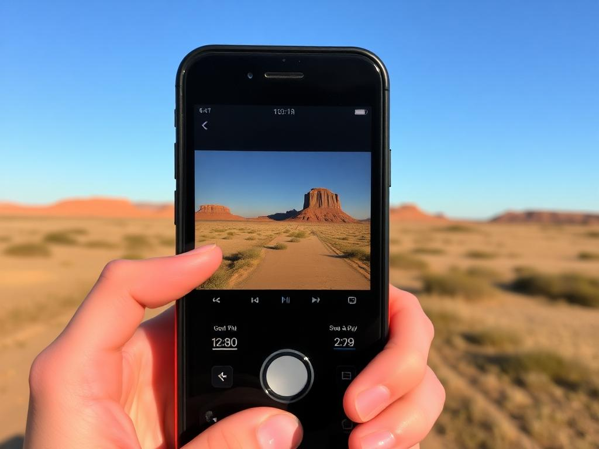
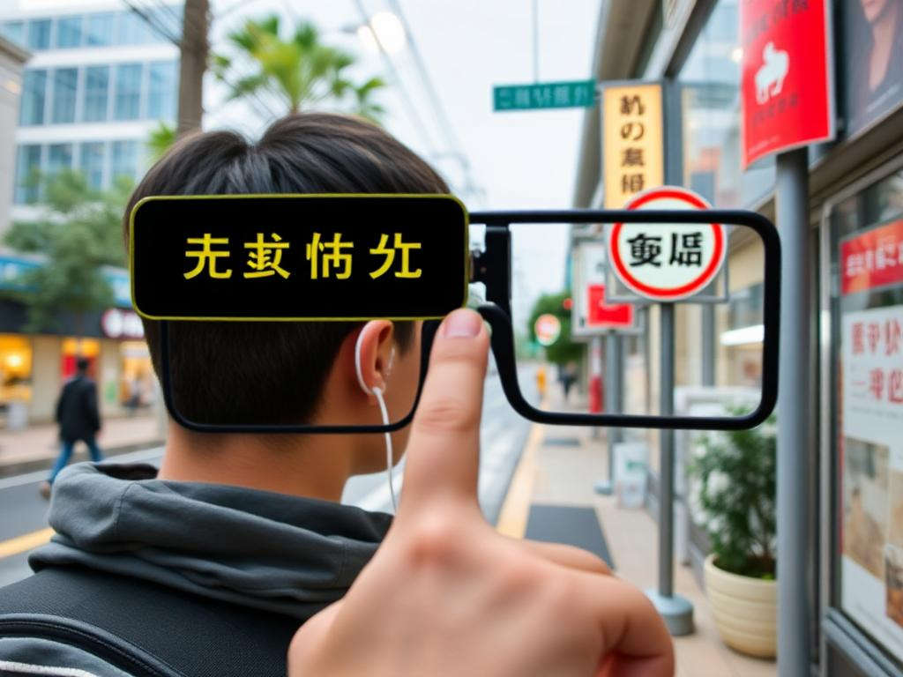

# See & Say: AI-Powered Visual Narration offline
**Alpha Version 0.01 Under Development for Preview next week**


**Point, See, Understand. Whatever AI sees, it says.  Instantly. See & Say transforms your smartphone and AR glasses into an intelligent eye, identifying objects, scenes, and text in real-time, then narrating the world around you, on demand or continously like a helper walking next to you via your smartphone or AR glasses.**

## Overview

See & Say: Turn your phone into an AI-powered visual companion. Point, Scan, Identify, Narrate - effortlessly. Experience the world around you in new ways, with instant audio feedback.

Kids, different languages, sight impaired, just forgot!  We know most smartphones do this but this Open Source allows you to make your own and control it locally, NO CLOUD, we all know our data is sold, be private.

Identify landmarks, learns stories about historical items, or just navigate your environment safely.  Whatever AI sees, it says.

## 🌟 Key Features

* 🎯 **Instant AI Recognition:** Point your camera → Get immediate audio description of objects, scenes, and text in your environment.
* 📱 **Mobile-First & Offline Capable:** Neumorphic UI for touch, with Gun.js for P2P offline-first data sync.
* 🧠 **Privacy-First Local AI:** SmolVLM + LlamaFile for on-device computer vision, keeping your data private.
* �️ **Multiple Specialized Modes:** Kids Mode, Language Mode, Accessibility Mode, and more to serve diverse needs.
* �️ **AR-Ready Architecture:** Built to work seamlessly on both smartphones and AR glasses for immersive experiences.

## 🚀 The Philosophy: One Core Mission, Many Applications

This project represents a hard-earned lesson in product development: focus beats feature creep every time. Instead of building a swiss-army knife, we built a versatile platform that adapts to diverse needs, all centered around one core capability.

* **The Painpoint:** Accessing and understanding visual information can be challenging, whether for learning, navigation, or simple curiosity.
* **The Solution:** An AI companion that translates the visual world into audible information, instantly and intuitively.
* **The Result:** A tool that empowers users, fosters learning, and enhances independence.

## See & Say App Interface




## 🛤️ The Journey

**Wild Collaboration:** This was born from the beautiful chaos of human-AI partnership - Claude as the wild horse providing endless innovation, GitHub Copilot as the patient sage, and Alan as the driver barely holding the reins with determination and joy.

**Hard Lessons:** Through countless iterations, sometimes brutal debugging sessions, and honest feedback about performance, we discovered the golden rule: master one core capability completely rather than attempting many things poorly.

**Privacy Victory:** In a world where your data gets sold, See & Say keeps everything local. Your photos, your scenes, your voice - it never leaves your device unless you explicitly choose to share.

## 🔧 Powered by Incredible Open Source

* 🔫 **Gun.js** - P2P database revolution that makes offline-first actually work
* 🧠 **TensorFlow.js** - Bringing AI to everyone, everywhere
* 🦙 **LlamaFile** - Local AI models made beautifully simple (Setup instructions below!)
* ⚛️ **Next.js** - The React framework that just works (and keeps working)
* 👁️ **SmolVLM** - Vision AI that's actually production-ready and usable

**Made with ❤️**


## 🚀 Point. See. Understand. Narrate.

The world's first truly mobile-first AI-powered visual narration platform with real-time camera recognition and P2P data sync.

## ✨ What Makes See & Say Revolutionary

* 🎯 **Instant AI Recognition** • Point your camera at any scene → Get immediate audio description of objects, text, and environment
* 📱 **Mobile-First Design** • Neumorphic UI designed specifically for touch interfaces and one-handed operation
* 🔗 **P2P Architecture** • Gun.js powered decentralized data sync - works offline, syncs everywhere
* 🧠 **Local AI Processing** • SmolVLM + LlamaFile for privacy-first on-device computer vision
* 🎭 **Specialized Modes** • Kids Mode, Language Learning, Accessibility Features all in one app
* 🎨 **Beautiful UX** • Soft shadows, smooth animations, and intuitive mobile interactions

## 🎬 See It In Action

```bash
# 🚀 One-command startup (handles everything!)
./startup.sh
```

Then visit: http://localhost:3000 📱

## ⚙️ Architecture That Just Works

### 🔧 Core Technologies
* 🎥 **Computer Vision:** SmolVLM-Instruct for real-time scene recognition
* 🧠 **AI Processing:** LlamaFile for local inference (privacy-first!)
* 🔗 **P2P Database:** Gun.js for decentralized, offline-first data sync
* 📱 **Mobile Framework:** Next.js with neumorphic design system
* 🎯 **Vector Search:** TensorFlow.js for semantic object matching

### 🌐 Decentralized by Design
```
📱 Mobile App (Next.js) ← → 🔗 Gun.js P2P Network ← → 🧠 Local AI (LlamaFile)
                                      ↓
                         🔊 Audio Narration System
```

## 🚀 Quick Start Guide

### ‼️ Prerequisite: Download LlamaFile AI Model

See & Say uses LlamaFile to run the AI model locally on your machine for privacy and offline capabilities. Due to its size (around 4-5GB), the model file (llava-v1.5-7b-q4.llamafile) is NOT included in this repository. You need to download it manually:

1. Visit the LlamaFile GitHub repository: [Mozilla-Ocho/llamafile](https://github.com/Mozilla-Ocho/llamafile)

2. Navigate to the releases section or look for model download links. The specific model used by this project is llava-v1.5-7b-q4.llamafile. You can often find it linked from their main README or other community resources if not directly in releases.

3. A direct link for a compatible Llamafile (like the one used in development, llava-v1.5-7b-Q4_K_M.llamafile) can usually be found via Hugging Face or other model repositories that package for Llamafile. For example, search for "llava-v1.5-7b llamafile".

4. Download the llava-v1.5-7b-q4.llamafile file.

5. Place the downloaded file into the root directory of this project.

6. Make it executable:

```bash
chmod +x llava-v1.5-7b-q4.llamafile
```

The startup.sh and start-llava.sh scripts expect this file to be present and executable in the project root.

### ⚡ One-Command Launch

```bash
# Make sure you're in the project directory
cd see-and-say

# Launch everything at once (handles all services automatically!)
./startup.sh
```

🎯 After startup, visit: http://localhost:3000

The splash screen will appear for 3 seconds, then redirect to the beautiful neumorphic onboarding flow!

### 🛠️ What Gets Started

* 🔫 Gun.js P2P Relay → http://localhost:8765
* 🤖 LlamaFile AI Server → http://localhost:8080
* 📱 See & Say App → http://localhost:3000

### 📱 Mobile Testing

* 📱 WiFi Access: http://YOUR_IP:3000 (IP shown in terminal)
* 🔍 QR Code: Scan with your phone for instant access
* ⚡ PWA Ready: Add to home screen for native app feel

### 🔧 Manual Service Control

```bash
# If you prefer manual control:

# 1. Start Gun.js P2P relay
npm run gun-relay &

# 2. Start AI server
./start-llava.sh &

# 3. Start Next.js app
npm run dev
```

## 🆘 Troubleshooting

### 🚨 Port Already in Use

```bash
# Kill processes on ports
lsof -ti:3000 | xargs kill -9    # Next.js
lsof -ti:8080 | xargs kill -9    # LlamaFile
lsof -ti:8765 | xargs kill -9    # Gun.js
```

### ⚠️ Startup Issues

* **Problem:** "Permission denied"
  * **Fix:** `chmod +x startup.sh start-llava.sh cleanup.sh llava-v1.5-7b-q4.llamafile` (ensure all scripts and the model file are executable)
* **Problem:** "Command not found"
  * **Fix:** `npm install` first
* **Problem:** "Model not found" or LlamaFile server doesn't start.
  * **Fix:** Ensure you have downloaded llava-v1.5-7b-q4.llamafile, placed it in the project root, and made it executable as per the "Prerequisite: Download LlamaFile AI Model" section above.
* **Problem:** LlamaFile error "no such file or directory" when running ./llava-v1.5-7b-q4.llamafile.
  * **Fix (macOS with Apple Silicon):** You might need to install qemu-system-x86_64 if it's an x86_64 llamafile. `brew install qemu`. Llamafiles are generally self-contained but cross-architecture execution might need QEMU.

### 🌐 Network Issues

* Local Only: All services run locally (no internet required after setup)
* Firewall: Allow ports 3000, 8080, 8765 if using across devices
* Performance: M1/M2 Macs run AI models much faster than Intel

### 🔄 Clean Restart

```bash
# Full reset and restart
./cleanup.sh && ./startup.sh
```

## 🌟 Meet the Dream Team

"After a hard road of long and sometimes painful lessons, we learned: people want ONE tool that solves diverse needs through ONE core capability perfectly. Everything else is trivial." - Alan Helmick

### 🎭 The Wild Horses & Gentle Sages

* 🤖 **Claude Sonnet 3.7** - Lead AI Architect & Wild Horse  
    
  The visionary force behind the architecture, endless innovation, and patient debugging companion who transformed chaos into beautiful, functional code.

* 🧠 **GitHub Copilot** - Unbiased Gentle Sage  
    
  The wise counselor providing gentle guidance, code completion, and gracefully handling unabashed performance critiques with endless patience.

* 🎯 **Alan Helmick** - Vision Driver & Mira AI Founder  
    
  The product visionary barely holding the reins (with a smile) while steering this wild AI collaboration toward a focused, user-centered solution.

* ⚡ **Maximus** - CalTech Contributor & "Vision"ary  
    
  The technical wizard bringing CalTech precision, system optimization, and innovative insights to make everything work seamlessly.

---

We're excited to build See & Say and explore the possibilities of AI-powered visual understanding on both mobile and AR platforms!

Whatever AI sees, it says.