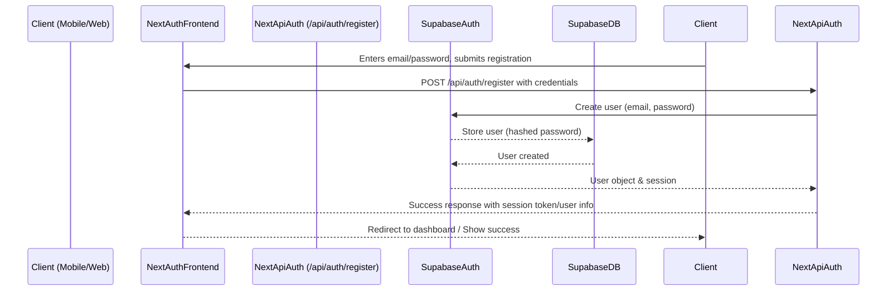
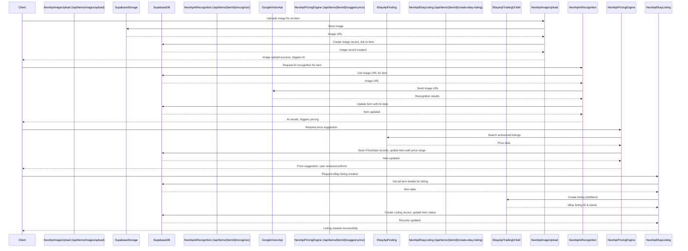

# eBay Helper - System Architecture

## 1. Introduction & Goals

This document outlines the system architecture for the **ebay-helper** application. The primary goal is to create a scalable, secure, and modular Next.js application, deployed on Vercel, designed for a mobile-first user experience. The application will assist users in photographing items, obtaining AI-driven pricing and eBay listing suggestions, and managing their inventory.

This architecture is based on the specifications detailed in:
*   User Stories: [`spec/phase_1_user_stories.md`](../spec/phase_1_user_stories.md)
*   Data Models: [`spec/phase_2_data_models.md`](../spec/phase_2_data_models.md)
*   Pseudocode (Authentication, Image Upload, AI Recognition, Pricing Engine, eBay Listing, Inventory Management): [`spec/phase_3_auth_pseudocode.md`](../spec/phase_3_auth_pseudocode.md), [`spec/phase_3_image_upload_pseudocode.md`](../spec/phase_3_image_upload_pseudocode.md), [`spec/phase_3_ai_recognition_pseudocode.md`](../spec/phase_3_ai_recognition_pseudocode.md), [`spec/phase_3_pricing_engine_pseudocode.md`](../spec/phase_3_pricing_engine_pseudocode.md), [`spec/phase_3_ebay_listing_pseudocode.md`](../spec/phase_3_ebay_listing_pseudocode.md), [`spec/phase_3_inventory_management_pseudocode.md`](../spec/phase_3_inventory_management_pseudocode.md)
*   Validation & Technology Suggestions: [`spec/phase_4_validation_and_suggestions.md`](../spec/phase_4_validation_and_suggestions.md)

## 2. Architectural Principles

*   **Modular Design:** Components and services will have well-defined responsibilities and clear interfaces, promoting separation of concerns.
*   **Scalability:** Leverage Vercel's serverless infrastructure and scalable backend services (e.g., Supabase) to handle growing user load and data.
*   **Security:** Implement security best practices at all layers, including authentication, authorization, data protection, and secure API interactions.
*   **Maintainability:** Promote clean code, clear documentation, and a well-organized codebase for ease of future development and maintenance.
*   **Mobile-First:** UI/UX will be optimized for mobile devices, ensuring a responsive and intuitive experience.
*   **Vercel-Optimized:** The architecture will take advantage of Vercel's features for deployment, serverless functions, and edge capabilities.
*   **API-Driven:** Core functionalities will be exposed via APIs, facilitating frontend-backend communication and potential future integrations.

## 3. System Overview

The ebay-helper application will be a Next.js application where:
*   The **Frontend** is built using Next.js (React components, pages).
*   The **Backend Logic** is implemented as Next.js API Routes, running as serverless functions on Vercel.
*   **External Services** are utilized for specialized functionalities:
    *   **Authentication:** Supabase Auth
    *   **Database:** Supabase PostgreSQL
    *   **File Storage:** Supabase Storage
    *   **AI Item Recognition:** Google Cloud Vision API
    *   **eBay Integration:** eBay APIs (Finding API, Trading API or Sell API)

This approach creates a "modular monolith" where the core application logic resides within the Next.js project, simplifying development and deployment while still benefiting from the scalability and managed nature of external services.

## 4. Technology Stack Choices

Based on [`spec/phase_4_validation_and_suggestions.md`](../spec/phase_4_validation_and_suggestions.md:1):

*   **Framework:** Next.js (React)
*   **Deployment Platform:** Vercel
*   **Authentication:** **Supabase Auth**. It provides email/password, OAuth (Google, Apple), JWT handling, and integrates seamlessly with Supabase's database and row-level security.
*   **Database:** **Supabase PostgreSQL**. Offers a managed relational database, real-time capabilities, and integrates with Supabase Auth for row-level security.
*   **File Storage:** **Supabase Storage**. Provides S3-compatible object storage with access controls integrated with Supabase Auth. This simplifies permission management for user-uploaded images.
*   **AI Item Recognition:** **Google Cloud Vision API**. Chosen for its robust object and label detection capabilities. The system will be designed to potentially swap this provider if needed.
*   **eBay Integration:**
    *   **eBay Finding API:** For searching active and sold listings (pricing research).
    *   **eBay Trading API or Sell API (Inventory):** For creating and managing listings. The Trading API is more established for `AddItem` calls, but the newer Sell API (RESTful) should be investigated for suitability, especially its Inventory API component. The choice may depend on the specific features required and developer preference for XML vs. REST. User-specific OAuth tokens will be essential.
*   **Styling:** Tailwind CSS (recommended for utility-first rapid UI development, pairs well with Next.js).
*   **State Management (Frontend):** React Context API for simple state, Zustand or Jotai for more complex global state if needed (lightweight alternatives to Redux).

## 5. Component Breakdown

### 5.1. Frontend (Next.js `pages/` and `components/`)

*   **UI Components:** Reusable React components for forms, navigation, item display, image handling, etc.
*   **Pages:**
    *   Auth pages (Login, Register, Forgot Password)
    *   Dashboard/Inventory List page
    *   Item Detail page (viewing, editing)
    *   New Item flow (Image capture, AI results, Price suggestion, Listing form)
    *   User Profile/Settings page

### 5.2. Backend Services (Next.js API Routes - `pages/api/`)

These services correspond to the functionalities outlined in the pseudocode documents.

*   **Authentication Service (`/api/auth/*`)**
    *   Responsibilities: User registration, login, logout, session management (leveraging Supabase Auth).
    *   Endpoints: `POST /register`, `POST /login`, `POST /logout`, `GET /me` (as per [`spec/phase_3_auth_pseudocode.md`](../spec/phase_3_auth_pseudocode.md:7)).
*   **Item Service (`/api/items/*`)**
    *   Responsibilities: Core CRUD operations for items. This service is central and orchestrates calls to other services or directly interacts with the database for item-specific data.
    *   Endpoints: (Covered by Inventory Management Service for user-facing CRUD, but internal logic for item creation/updates will exist here).
*   **Image Service (`/api/items/images/*`)**
    *   Responsibilities: Handling image uploads, linking images to items, interacting with Supabase Storage.
    *   Endpoints: `POST /upload` (as per [`spec/phase_3_image_upload_pseudocode.md`](../spec/phase_3_image_upload_pseudocode.md:63)).
    *   Additional endpoints for deleting or reordering images might be needed.
*   **AI Recognition Service (`/api/items/{itemId}/recognize`)**
    *   Responsibilities: Triggering item recognition by sending an image URL to Google Cloud Vision API, processing results, and updating the item.
    *   Endpoints: `POST /` (as per [`spec/phase_3_ai_recognition_pseudocode.md`](../spec/phase_3_ai_recognition_pseudocode.md:7)).
*   **Pricing Engine Service (`/api/items/{itemId}/suggest-price`)**
    *   Responsibilities: Fetching pricing data from eBay APIs (and potentially other sources), calculating a suggested price range, storing `PriceData` records, and updating the item.
    *   Endpoints: `POST /` (as per [`spec/phase_3_pricing_engine_pseudocode.md`](../spec/phase_3_pricing_engine_pseudocode.md:7)).
*   **eBay Listing Service (`/api/items/{itemId}/create-ebay-listing`)**
    *   Responsibilities: Preparing listing data, interacting with eBay APIs to create/manage listings, and updating local `Listing` records.
    *   Endpoints: `POST /` (as per [`spec/phase_3_ebay_listing_pseudocode.md`](../spec/phase_3_ebay_listing_pseudocode.md:7)).
    *   Additional endpoints for revising or ending listings will be necessary.
*   **Inventory Management Service (`/api/items/*`)**
    *   Responsibilities: Provides a comprehensive API for managing a user's inventory, including creating, reading, updating, and deleting items, with support for filtering, searching, and pagination.
    *   Endpoints: `POST /`, `GET /`, `GET /{itemId}`, `PUT /{itemId}`, `DELETE /{itemId}` (as per [`spec/phase_3_inventory_management_pseudocode.md`](../spec/phase_3_inventory_management_pseudocode.md:9)).

### 5.3. External Services (as per Technology Stack)

*   **Supabase:** Provides Auth, Database (PostgreSQL), and Storage.
*   **Google Cloud Vision API:** For AI-powered item recognition.
*   **eBay APIs:** For pricing research and listing management.

## 6. Data Model & Database Design

The database schema will be based on the data models defined in [`spec/phase_2_data_models.md`](../spec/phase_2_data_models.md:1). Supabase PostgreSQL will be used.

*   **`User` Table:** Stores user authentication and profile information.
*   **`Item` Table:** Core table for items, linking to user, images, AI data, pricing, and listings.
*   **`Image` Table:** Stores metadata for uploaded images, including storage URL (Supabase Storage) and links to items/users.
*   **`Listing` Table:** Stores details of eBay listings created through the app, including eBay's listing ID and status.
*   **`PriceData` Table:** Stores individual price points collected from various sources for an item.

**Relationships:**
*   User 1--* Item
*   Item 1--* Image
*   Item 1--* PriceData
*   Item 1--1 Listing (an item can have one active/draft local listing record)

**Indexing:**
Indexes will be created on foreign keys (`userId`, `itemId`), unique fields (`User.email`, `Listing.ebayListingId`), and fields frequently used in queries/filters (`Item.status`, `PriceData.source`). Supabase handles primary key indexing automatically.

**Row-Level Security (RLS):**
Supabase RLS policies will be extensively used to ensure users can only access and modify their own data. For example, a policy on the `Item` table would ensure `SELECT`, `INSERT`, `UPDATE`, `DELETE` operations are only allowed if `auth.uid() = Item.userId`.

## 7. Data Flow Diagrams (Conceptual)

Mermaid.js syntax is suggested for generating these diagrams.

### 7.1. New User Registration



### 7.2. New Item Creation & Listing Flow



## 8. API Design

### 8.1. Internal APIs (Next.js API Routes)

The API endpoints are largely defined by the pseudocode documents (see section 5.2). They will follow RESTful principles.
*   Authentication will use JWTs (managed by Supabase Auth) sent in the `Authorization` header.
*   Request and response bodies will be JSON.
*   Standard HTTP status codes will be used for success and errors.
*   Input validation will be performed on all incoming requests.

### 8.2. External API Usage

*   **Supabase Client Libraries:** The Supabase JS client library will be used for interacting with Auth, Database, and Storage.
*   **Google Cloud Vision API:** Use Google's client library or direct HTTP requests. API key will be stored securely.
*   **eBay APIs:**
    *   Use appropriate SDKs if available and well-maintained, or direct HTTP requests.
    *   Handle OAuth 2.0 for user authentication with eBay. Securely store and refresh user-specific eBay OAuth tokens.
    *   API keys/credentials for the application itself will be stored securely.

## 9. Security Considerations

*   **Authentication & Authorization:**
    *   Supabase Auth for robust authentication (password hashing, OAuth, JWTs).
    *   Supabase Row-Level Security (RLS) to enforce data access policies at the database level.
    *   API routes will validate JWTs and user permissions for every request.
*   **Data Security:**
    *   **In Transit:** HTTPS for all communication (Vercel handles this by default).
    *   **At Rest:** Supabase encrypts data at rest. Sensitive data like API keys for external services will NOT be stored in the database.
*   **API Key Management:**
    *   API keys for Google Cloud Vision, eBay app credentials, etc., will be stored as environment variables in Vercel. They will not be exposed to the client-side.
    *   User-specific eBay OAuth tokens will be encrypted before being stored in the database (e.g., using a symmetric encryption key stored as a Vercel environment variable).
*   **Input Validation:**
    *   All API inputs (body, query params, path params) will be rigorously validated on the server-side to prevent injection attacks, XSS, etc. Libraries like Zod or Joi can be used.
*   **Secure File Uploads:**
    *   Validate file types and sizes on both client and server.
    *   Supabase Storage access controls will ensure only authenticated users can upload to their designated paths and that files are served with appropriate permissions.
*   **Rate Limiting:** Consider rate limiting for sensitive endpoints (e.g., login, registration) to prevent abuse. Vercel offers some capabilities, or custom logic can be added.
*   **Dependencies:** Keep dependencies updated to patch known vulnerabilities.
*   **Content Security Policy (CSP):** Implement CSP headers to mitigate XSS risks.

## 10. Scalability & Performance

*   **Vercel Serverless Functions:** Next.js API routes deploy as serverless functions, which scale automatically with demand.
*   **Supabase Scalability:** Supabase is built on PostgreSQL and designed for scalability. Monitor usage and upgrade plans as needed. Read replicas can be considered for read-heavy workloads if Supabase supports this for the chosen plan.
*   **CDN:** Vercel automatically serves static assets (JS, CSS, images in `public/`) via its global CDN. Images from Supabase Storage can also be served via a CDN if configured (Supabase Storage has built-in CDN capabilities).
*   **Efficient Data Fetching:**
    *   Use server-side data fetching (`getServerSideProps`, `getStaticProps`) in Next.js where appropriate.
    *   Optimize database queries (proper indexing, selecting only necessary fields).
    *   Implement pagination for lists.
*   **Frontend Performance:**
    *   Code splitting (default in Next.js).
    *   Image optimization (e.g., using `next/image`).
    *   Lazy loading for offscreen content.
*   **Task Queues/Background Jobs (Future Consideration):** For long-running processes like complex AI analysis or bulk eBay operations (if ever needed), consider services like Vercel Cron Jobs to trigger serverless functions, or dedicated queue services (e.g., AWS SQS with Lambda, or a Supabase Edge Function triggered by DB events/HTTP). For the current scope, direct API calls should suffice.

## 11. Deployment Strategy

*   **Platform:** Vercel.
*   **CI/CD:** Vercel integrates directly with Git repositories (GitHub, GitLab, Bitbucket) for automatic deployments on push/merge to specified branches (e.g., `main` for production, `develop` for staging).
*   **Environment Variables:**
    *   Vercel provides a UI and CLI for managing environment variables for different environments (Production, Preview, Development).
    *   Store Supabase URLs/anon keys, Google API keys, eBay app credentials, JWT secrets, etc., here.
*   **Database Migrations:**
    *   Supabase provides a migration system. Migrations should be developed locally, tested, and then applied to staging/production environments.
    *   Store migration files in the Git repository.
*   **Branching Strategy:**
    *   A Git flow like strategy (e.g., `main` for production, `develop` for integration, feature branches for new work) is recommended.
*   **Testing:**
    *   Unit and integration tests should be run as part of the CI/CD pipeline before deployment.
    *   E2E tests (e.g., using Playwright or Cypress) can be run against preview deployments.

## 12. Diagrams (To be generated using Mermaid.js or similar)

*   **Component Diagram:** Shows major frontend components, backend API services, and external services, and their primary interactions.
    ```mermaid
    graph TD
        subgraph UserDevice [User Device]
            Frontend[Next.js Frontend App]
        end

        subgraph VercelPlatform [Vercel Platform]
            subgraph NextJsApiRoutes [Next.js API Routes]
                AuthService[/api/auth]
                ItemService[/api/items]
                ImageService[/api/items/images]
                AiService[/api/items/.../recognize]
                PricingService[/api/items/.../suggest-price]
                EbayListingService[/api/items/.../create-ebay-listing]
            end
        end

        subgraph ExternalServices [External Services]
            Supabase[Supabase: Auth, DB, Storage]
            GoogleVision[Google Cloud Vision API]
            EbayAPI[eBay APIs]
        end

        Frontend --> AuthService
        Frontend --> ItemService
        Frontend --> ImageService
        Frontend --> AiService
        Frontend --> PricingService
        Frontend --> EbayListingService

        AuthService --> Supabase
        ItemService --> Supabase
        ImageService --> Supabase
        AiService --> Supabase
        AiService --> GoogleVision
        PricingService --> Supabase
        PricingService --> EbayAPI
        EbayListingService --> Supabase
        EbayListingService --> EbayAPI
    ```

*   **Deployment Diagram (Simplified for Vercel):** Illustrates how the Next.js app and its serverless functions are hosted on Vercel and interact with external BaaS/SaaS.
    ```mermaid
    graph TD
        User[User via Browser/Mobile] --> VercelCDN[Vercel Edge Network / CDN]
        
        subgraph VercelPlatform [Vercel Platform]
            VercelCDN --> NextJsApp[Next.js Application Frontend]
            VercelCDN --> ServerlessFunctions[Next.js API Routes (Serverless Functions)]
        end

        NextJsApp --> ServerlessFunctions
        ServerlessFunctions --> Supabase[Supabase (Auth, DB, Storage)]
        ServerlessFunctions --> GoogleVision[Google Cloud Vision API]
        ServerlessFunctions --> EbayAPI[eBay APIs]
    ```

*   **Sequence Diagrams:** (As described in section 7, for key user flows).

This architecture document provides a blueprint for developing the ebay-helper application. It will be a living document and may evolve as development progresses and new insights are gained.